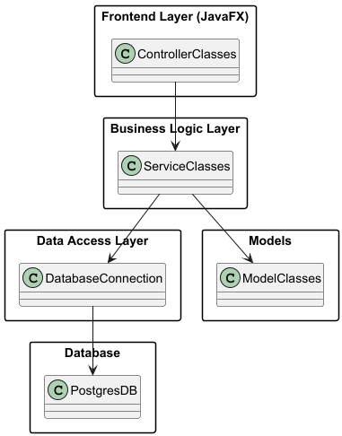

# System Documentation – Lunchify

## Table of Contents

- [Overview](#overview)
- [Architecture](#architecture)
- [Technology Stack](#technology-stack)
- [Authentication & Authorization](#authentication--authorization)
- [Database](#database)
- [Application Workflow](#application-workflow)
- [OCR & Receipt Handling](#ocr--receipt-handling)
- [Reporting & Exports](#reporting--exports)
- [Deployment](#deployment)
- [Configuration](#configuration)
- [Limitations](#limitations)

---

## Overview

**Lunchify** is a desktop application developed in JavaFX that enables employees to submit lunch receipts for partial reimbursement. Administrators can view, manage, and export data for payroll integration. The software is intended for internal use within a company and is not optimized for high concurrency beyond a moderate number of users.

---

## Architecture

Lunchify follows the **MVC (Model-View-Controller)** pattern:

- **Model**: Manages business logic and data access using JDBC.
- **View**: Implemented with JavaFX for the user interface.
- **Controller**: Handles input and updates both the model and the view.  
 

### Structure 

src  
├── main  
│   ├── java  
│   │   ├── backend  
│   │   │   ├── configs  
│   │   │   ├── exceptions  
│   │   │   ├── interfaces  
│   │   │   ├── logic  
│   │   │   ├── model  
│   │   ├── database  
│   │   ├── frontend  
│   │   │   ├── controller  
│   │   │   ├── views  
│   ├── resources  
│   │   ├── frontend  
│   │   │   ├── images  
│   │   │   ├── views  
│   │   ├── tessdata  
├── test  
│   ├── java   
│   │   ├── backend  
│   │   │   ├── logic  
│   │   ├── databaseTests  
│   │   ├── lunchifyTests  
│   │   ├── uiTest  
│   ├── resources  
  
---

## Technology Stack

- **Programming Language**: Java 21 (Oracle OpenJDK 21.0.6)
- **UI Framework**: JavaFX SDK 21.6.0
- **Database**: PostgreSQL
- **Database Access**: JDBC
- **Authentication**: BCrypt (password hashing)
- **OCR Engine**: Tesseract
- **Executable Format**: `.jar` file
- **Startup**: GUI executable

---

## Authentication & Authorization

- All users must log in with email and password.
- Passwords are hashed using **BCrypt** before storage.
- The first admin must be created manually in the PostgreSQL database.
- Admins can add users within the application.
- Admins can set users inactive within the application. Inactive Users cannot login.
- Role-based access:
    - **Users** can upload and manage receipts and their own reimbursement.
    - **Admins** can appprove/reject reimbursements, view/export reports, configure the system, and manage users.

---

## Database

- The PostgreSQL database must be initialized using an SQL [script](../Database.md) **prior to first use**.
- hard-coded
```java
    private static final String URL="jdbc:postgresql://localhost:5432/postgres";
    private static final String USER="postgres";
    private static final String PASSWORD="!!Lunch4";
```
- Data includes:
    - User accounts (with roles)
    - Receipts and reimbursement records
    - Monthly configuration (e.g., refund limits)
- Table **notifications** can be used for audits.
  
---

## Application Workflow

### User Flow:
1. Log in using email and password.
2. Upload daily receipt (JPEG, PNG, PDF).
3. Enter or confirm amount and classification (restaurant/supermarket).
4. Submit for reimbursement.
5. View past submissions and statuses.
6. Edit or delete submissions until end of month.

### Admin Flow:
1. Log in as admin.
2. View all receipts and statistics.
3. Review automatically detected anomalies.
4. Delete/Edit Reimbursements.
5. Approve/Reject Reimbursements.
6. Export data for payroll.
7. Manage refund rules and users. 

---

## OCR & Receipt Handling

- Text extraction from receipts is performed using **Tesseract OCR**.
- Automatic detection of:
    - Vendor type (restaurant vs. supermarket)
    - Amount
- Manual correction possible before submission.

---

## Reporting & Exports

Admins can:
- Generate reports:
    - Receipt count per month/user
    - Vendor type distribution
    - Total reimbursement amounts
    - and export view as .pdf or .csv
- Export data for payroll system (.json / .xml)

---

## Deployment
- Distributed as a `.jar` file.
- Can be launched via GUI (double-click or platform-specific application wrapper).
- Manual updates only (no auto-updater).

---

## Configuration

Configuration options (admin-only):
- Reimbursement limits (restaurant, supermarket)
- User account management

---

## Limitations

- Not intended for use by thousands of users simultaneously.
- Currently only available in **German**.
- No Dark Mode or mobile/web version.
- Receipt edits are only allowed until the last day of the current month.
